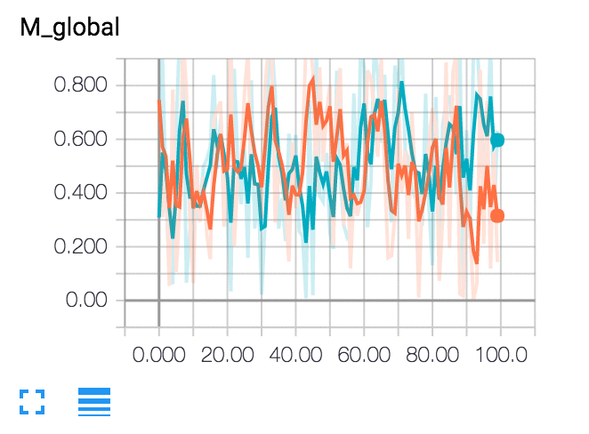

# tensorboardX

[](https://travis-ci.org/lanpa/tensorboardX)
[](https://badge.fury.io/py/tensorboardX)
[](https://bigquery.cloud.google.com/savedquery/966219917372:edb59a0d70c54eb687ab2a9417a778ee)
[](https://tensorboardx.readthedocs.io/en/latest/?badge=latest)
[](https://codecov.io/gh/lanpa/tensorboardX/)

Write TensorBoard events with simple function call.

* Support `scalar`, `image`, `figure`, `histogram`, `audio`, `text`, `graph`, `onnx_graph`, `embedding`, `pr_curve`, `mesh`
  and `video` summaries.

* requirement for `demo_graph.py` is tensorboardX>=1.6 and pytorch>=1.1

* [FAQ](https://github.com/lanpa/tensorboardX/wiki)

## Install

Tested on anaconda2 / anaconda3, with PyTorch 1.1.0 / torchvision 0.3 / tensorboard 1.13.0

`pip install tensorboardX`

or build from source:

`git clone https://github.com/lanpa/tensorboardX && cd tensorboardX && python setup.py install`

You can optionally install [`crc32c`](https://github.com/ICRAR/crc32c) to speed up saving a large amount of data.


## Example

* Run the demo script: `python examples/demo.py`
* Use TensorBoard with `tensorboard --logdir runs`  (needs to install TensorFlow)

```python
# demo.py

import torch
import torchvision.utils as vutils
import numpy as np
import torchvision.models as models
from torchvision import datasets
from tensorboardX import SummaryWriter

resnet18 = models.resnet18(False)
writer = SummaryWriter()
sample_rate = 44100
freqs = [262, 294, 330, 349, 392, 440, 440, 440, 440, 440, 440]

for n_iter in range(100):

    dummy_s1 = torch.rand(1)
    dummy_s2 = torch.rand(1)
    # data grouping by `slash`
    writer.add_scalar('data/scalar1', dummy_s1[0], n_iter)
    writer.add_scalar('data/scalar2', dummy_s2[0], n_iter)

    writer.add_scalars('data/scalar_group', {'xsinx': n_iter * np.sin(n_iter),
                                             'xcosx': n_iter * np.cos(n_iter),
                                             'arctanx': np.arctan(n_iter)}, n_iter)

    dummy_img = torch.rand(32, 3, 64, 64)  # output from network
    if n_iter % 10 == 0:
        x = vutils.make_grid(dummy_img, normalize=True, scale_each=True)
        writer.add_image('Image', x, n_iter)

        dummy_audio = torch.zeros(sample_rate * 2)
        for i in range(x.size(0)):
            # amplitude of sound should in [-1, 1]
            dummy_audio[i] = np.cos(freqs[n_iter // 10] * np.pi * float(i) / float(sample_rate))
        writer.add_audio('myAudio', dummy_audio, n_iter, sample_rate=sample_rate)

        writer.add_text('Text', 'text logged at step:' + str(n_iter), n_iter)

        for name, param in resnet18.named_parameters():
            writer.add_histogram(name, param.clone().cpu().data.numpy(), n_iter)

        # needs tensorboard 0.4RC or later
        writer.add_pr_curve('xoxo', np.random.randint(2, size=100), np.random.rand(100), n_iter)

dataset = datasets.MNIST('mnist', train=False, download=True)
images = dataset.test_data[:100].float()
label = dataset.test_labels[:100]

features = images.view(100, 784)
writer.add_embedding(features, metadata=label, label_img=images.unsqueeze(1))

# export scalar data to JSON for external processing
writer.export_scalars_to_json("./all_scalars.json")
writer.close()
```

## Screenshots



## Tweaks

To add more ticks for the slider (show more image history), check https://github.com/lanpa/tensorboardX/issues/44 or 
https://github.com/tensorflow/tensorboard/pull/1138

## Reference

* [TeamHG-Memex/tensorboard_logger](https://github.com/TeamHG-Memex/tensorboard_logger)
* [dmlc/tensorboard](https://github.com/dmlc/tensorboard)
