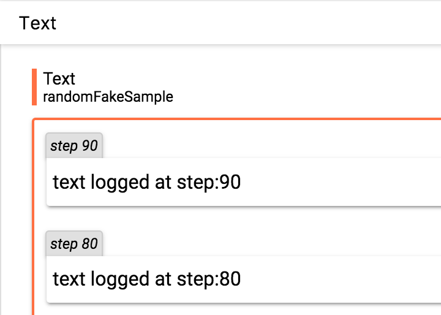

[](https://travis-ci.org/lanpa/tensorboard-pytorch)
# tensorboard-pytorch

Write tensorboard events with simple command.

including scalar, image, histogram, audio, text, graph and embedding.

see [demo](http:35.197.26.245:6006) (result of `demo.py` and some images generated by BEGAN)

## install

`#tested on anaconda2/anaconda3, tensorflow 1.2.1, pytorch 0.1.12, torchvision 0.1.8`

`pip install tensorboard-pytorch`

`pip install tensorflow`   or   `pip install tensorflow-gpu`

As this time (v0.1.12), to use the graph drawing feature, you need to build pytorch from source.

## usage
```python
import torch
import torchvision.utils as vutils
import numpy as np
import torchvision.models as models
from datetime import datetime
from tensorboard import SummaryWriter
resnet18 = models.resnet18(True)
writer = SummaryWriter('runs/'+datetime.now().strftime('%B%d  %H:%M:%S'))
sample_rate = 44100
freqs = [262, 294, 330, 349, 392, 440, 440, 440, 440, 440, 440]
for n_iter in range(100):
    M_global = torch.rand(1) # value to keep
    writer.add_scalar('M_global', M_global[0], n_iter)
    x = torch.rand(32, 3, 64, 64) # output from network
    if n_iter%10==0:
        x = vutils.make_grid(x, normalize=True, scale_each=True)   
        writer.add_image('Image', x, n_iter)
        x = torch.zeros(sample_rate*2)
        for i in range(x.size(0)):
            x[i] = np.cos(freqs[n_iter//10]*np.pi*float(i)/float(sample_rate)) # sound amplitude should in [-1, 1]
        writer.add_audio('Audio', x, n_iter)
        writer.add_text('Text', 'testtext', n_iter)
        for name, param in resnet18.named_parameters():
            writer.add_histogram(name, param.clone().cpu().data.numpy(), n_iter)
writer.close()
```

`python demo.py`

`tensorboard --logdir runs`  

scalar</br>


image</br>


audio</br>


distribution</br>


histogram</br>


text</br>

## tweaks
To show more images in tensorboard's image tab, just
modify the hardcoded `event_accumulator` in 
`~/anaconda3/lib/python3.6/site-packages/tensorflow/tensorboard/backend/application.py`
as you wish.

## API

`class SummaryWriter(str log_dir)`
###### parameter:
* `log_dir` (*str*) - the location of the log folder.

> `add_scalar(str tag, float value, int global_step=None)`
>> ###### parameter:
> * `value` (*float*) - the value to keep.
 
> `add_image(str tag, torch.Tensor t, int global_step=None)`
>> ###### parameter:
> * `t` (*torch.Tensor*) - torch tensor of size (3,H,W). I suggest use `torchvision.utils.make_grid()` to prepare it. 

> `add_audio(str tag, torch.Tensor t, int global_step=None)`
>> ###### parameter:
> * `t` (*torch.Tensor*) - one dimensional torch tensor. The value should between [-1, 1]. The sample rate is currently fixed at 44100 KHz.

>`add_histogram(str tag, numpy.ndarray values, int global_step=None, bins='tensorflow')`
>> ###### parameter:
> * `values` (*numpy.ndarray*) - one dimensional numpy array.
> * `bins` (*str*) - one of {'tensorflow', [numpy_arguments](https://docs.scipy.org/doc/numpy/reference/generated/numpy.histogram.html)}, determines how the bins are made.

>`add_text(str tag, str text_to_save, int  global_step=None)`
>> ###### parameter:
> * `text_to_save ` (*str*) - the string to keep.

>`add_graph(torch.nn.Module model, torch.autograd.Variable lastnode)`
>> ###### parameter:
> * `model ` (*torch.nn.Module*) - the model to draw.
> * `lastnode ` (*torch.autograd.Variable*) - the output variable of the model.

>> see `demo_graph.py`

>`add_embedding(torch.Tensor t, str save_path, list metadata=None, torch.Tensor label_img=None)`
>> ###### parameter:
> * `t ` (*torch.Tensor*) - A two dimensional tensor. Each row corresponds to one feature vector.
> * `save_path` (*str*) - save path
> * `metadata` (*list*) - a list of label composed of number or string. `len(metadata)` should equal the number of rows of `t`
> * `label_img` (*torch.Tensor*) - 4-D tensor (NCHW). `label_img.size(0)` should equal the number of rows of `t`

>> see `demo_embedding.py`

> ### Common parameters:
> * `tag` (*str*) - values with same tag group together.
> * `global_step` (*int*) - logs the training step on which the value is saved.


## TODO
audio sample rate


## reference:

https://github.com/TeamHG-Memex/tensorboard_logger

https://github.com/dmlc/tensorboard
