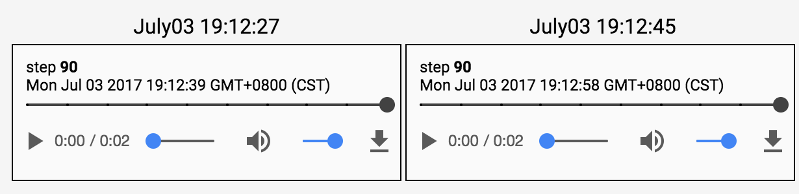
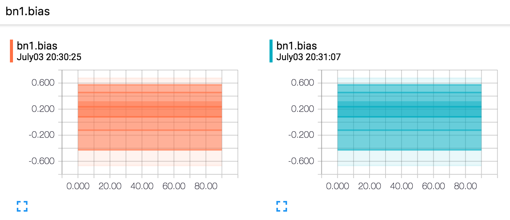
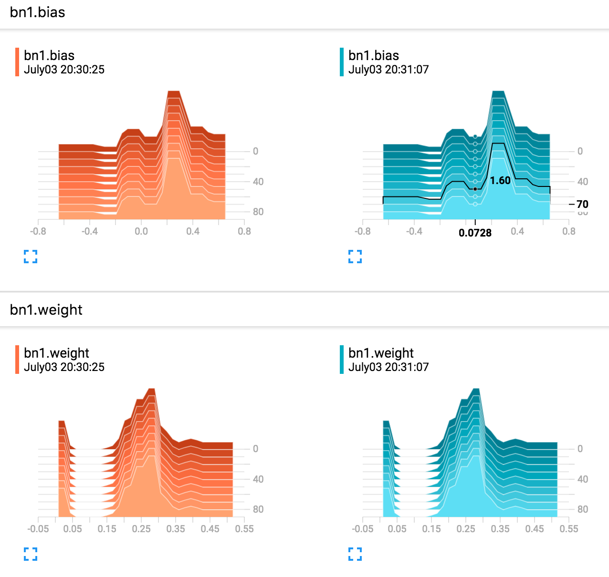

# tensorboard-pytorch

Write tensorboard events with simple command.

## install

`#tested on anaconda3 and tensorflow 1.2.1`

`pip install tensorboard-pytorch`

`pip install tensorflow`

or

`pip install tensorflow-gpu`

## usage
```python
import torch
import torchvision.utils as vutils
import numpy as np
import torchvision.models as models
from datetime import datetime
from tensorboard import SummaryWriter
resnet18 = models.resnet18(True)
writer = SummaryWriter('runs/'+datetime.now().strftime('%B%d  %H:%M:%S'))
sample_rate = 44100
freqs = [262, 294, 330, 349, 392, 440, 440, 440, 440, 440, 440]
for n_iter in range(100):
    M_global = torch.rand(1) # value to keep
    writer.add_scalar('M_global', M_global[0], n_iter)
    x = torch.rand(32, 3, 64, 64) # output from network
    if n_iter%10==0:
        x = vutils.make_grid(x, normalize=True, scale_each=True)   
        writer.add_image('Image', x, n_iter)
        x = torch.zeros(sample_rate*2)
        for i in range(x.size(0)):
            x[i] = np.cos(freqs[n_iter//10]*np.pi*float(i)/float(sample_rate)) # sound amplitude should in [-1, 1]
        writer.add_audio('Audio', x, n_iter)
        for name, param in resnet18.named_parameters():
            writer.add_histogram(name, param.clone().cpu().data.numpy(), n_iter)
writer.close()
```

` tensorboard --logdir runs`  

scalar</br>


image</br>


audio</br>


distribution</br>


histogram</br>

## tweaks
To show more images in tensorboard's image tab, just
modify the hardcoded `event_accumulator` in 
`~/anaconda3/lib/python3.6/site-packages/tensorflow/tensorboard/backend/application.py`
as you wish.


## live demo on google cloud platform (my implementation of BEGAN)
[here](http:35.197.26.245:6006)

## TODO
push pytorch specific utilities.

## reference:

https://github.com/TeamHG-Memex/tensorboard_logger

https://github.com/dmlc/tensorboard
