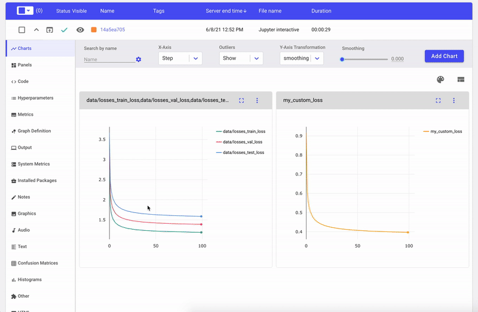

# tensorboardX

[](https://travis-ci.org/lanpa/tensorboardX)
[](https://badge.fury.io/py/tensorboardX)
[](https://tensorboardx.readthedocs.io/en/latest/?badge=latest)
[](https://codecov.io/gh/lanpa/tensorboardX/)

Write TensorBoard events with simple function call.

The current release (v2.5) is tested on anaconda3, with PyTorch 1.11.0 / torchvision 0.12 / tensorboard 2.9.0.

* Support `scalar`, `image`, `figure`, `histogram`, `audio`, `text`, `graph`, `onnx_graph`, `embedding`, `pr_curve`, `mesh`, `hyper-parameters`
  and `video` summaries.

* [FAQ](https://github.com/lanpa/tensorboardX/wiki)


## Install

`pip install tensorboardX`

or build from source:

`pip install 'git+https://github.com/lanpa/tensorboardX'`

You can optionally install [`crc32c`](https://github.com/ICRAR/crc32c) to speed up.

`pip install crc32c`

Starting from tensorboardX 2.1, You need to install `soundfile` for the `add_audio()` function (200x speedup).

`pip install soundfile`

## Example

* Clone the files in https://github.com/lanpa/tensorboardX/tree/master/examples
* Run the demo script: e.g. `python examples/demo.py`
* Start TensorBoard with `tensorboard --logdir runs`  


```python
# demo.py

import torch
import torchvision.utils as vutils
import numpy as np
import torchvision.models as models
from torchvision import datasets
from tensorboardX import SummaryWriter

resnet18 = models.resnet18(False)
writer = SummaryWriter()
sample_rate = 44100
freqs = [262, 294, 330, 349, 392, 440, 440, 440, 440, 440, 440]

for n_iter in range(100):

    dummy_s1 = torch.rand(1)
    dummy_s2 = torch.rand(1)
    # data grouping by `slash`
    writer.add_scalar('data/scalar1', dummy_s1[0], n_iter)
    writer.add_scalar('data/scalar2', dummy_s2[0], n_iter)

    writer.add_scalars('data/scalar_group', {'xsinx': n_iter * np.sin(n_iter),
                                             'xcosx': n_iter * np.cos(n_iter),
                                             'arctanx': np.arctan(n_iter)}, n_iter)

    dummy_img = torch.rand(32, 3, 64, 64)  # output from network
    if n_iter % 10 == 0:
        x = vutils.make_grid(dummy_img, normalize=True, scale_each=True)
        writer.add_image('Image', x, n_iter)

        dummy_audio = torch.zeros(sample_rate * 2)
        for i in range(x.size(0)):
            # amplitude of sound should in [-1, 1]
            dummy_audio[i] = np.cos(freqs[n_iter // 10] * np.pi * float(i) / float(sample_rate))
        writer.add_audio('myAudio', dummy_audio, n_iter, sample_rate=sample_rate)

        writer.add_text('Text', 'text logged at step:' + str(n_iter), n_iter)

        for name, param in resnet18.named_parameters():
            writer.add_histogram(name, param.clone().cpu().data.numpy(), n_iter)

        # needs tensorboard 0.4RC or later
        writer.add_pr_curve('xoxo', np.random.randint(2, size=100), np.random.rand(100), n_iter)

dataset = datasets.MNIST('mnist', train=False, download=True)
images = dataset.test_data[:100].float()
label = dataset.test_labels[:100]

features = images.view(100, 784)
writer.add_embedding(features, metadata=label, label_img=images.unsqueeze(1))

# export scalar data to JSON for external processing
writer.export_scalars_to_json("./all_scalars.json")
writer.close()
```

## Screenshots


## Using TensorboardX with Comet

TensorboardX now supports logging directly to [Comet](https://www.comet.ml/site/data-scientists/?utm_campaign=tensorboardx-integration&utm_source=github&utm_medium=readme). Comet is a **free** cloud based solution that allows you to automatically track, compare and explain your experiments. It adds a lot of functionality on top of tensorboard such as dataset management, diffing experiments, seeing the code that generated the results and more.

This works out of the box and just require an additional line of code. See a full code example in this [Colab Notebook](https://colab.research.google.com/drive/1cTO3tgZ03nuJQ8kOjZhEiwbB-45tV4lm?usp=sharing)

<p align="center">

</p>

## Tweaks

To add more ticks for the slider (show more image history), check https://github.com/lanpa/tensorboardX/issues/44 or 
https://github.com/tensorflow/tensorboard/pull/1138

## Reference

* [TeamHG-Memex/tensorboard_logger](https://github.com/TeamHG-Memex/tensorboard_logger)
* [dmlc/tensorboard](https://github.com/dmlc/tensorboard)
